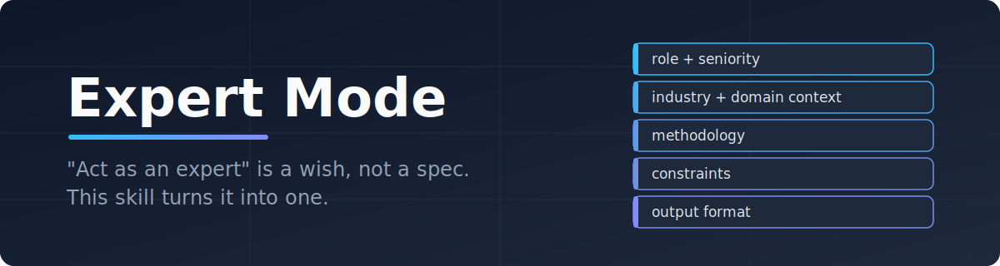
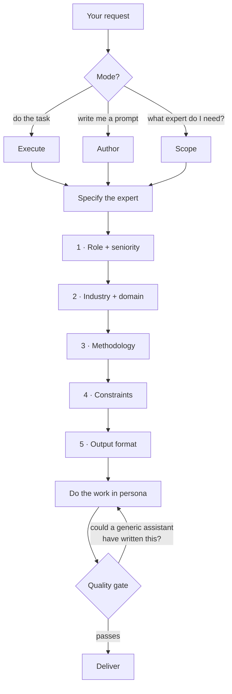

<div align="center">



**An Agent Skill that turns vague "act as an expert" requests into fully-specified expert engagements — and gets consultant-grade output instead of generic filler.**

[](LICENSE)
[](https://docs.claude.com/en/docs/agents-and-tools/agent-skills)
[](https://claude.com/claude-code)
[](#contributing)

`act as` · `think like` · `review this as a` · `write me an expert prompt` · `/expert-mode`

</div>

---

## The Problem

Everyone knows the trick: tell the model to "act as an expert." Almost nobody notices it doesn't work.

> "Act as a senior developer and review my architecture."

You get bullet points that could have come from any blog post. Confident, polished, and useless — because the "expert" has no seniority that changes their risk tolerance, no industry that shapes their priorities, no methodology that structures their thinking, no constraints that force tradeoffs, and no deliverable format that a real client would recognize.

**A persona without a specification is a costume.** The model wears it and keeps talking like itself.

## How It Works

Expert Mode forces every engagement through five dimensions before any work happens. If a dimension is missing, it gets resolved — inferred from context, or asked in one batched question. Generic personas are banned.



The quality gate rejects the output and redoes it if:

1. **The persona test fails** — the same output could have come from "act as a helpful assistant"
2. **The tradeoff test fails** — nothing was sacrificed; an answer that recommends everything recommends nothing
3. **The format test fails** — a "two-page brief" that runs to six pages is not a brief
4. **The assumptions test fails** — invented defaults and uncertainties aren't labeled

## Before / After

| | Without Expert Mode | With Expert Mode |
|---|---|---|
| **Persona** | "Act as a developer" | Senior Backend Engineer, 8 yrs in distributed systems |
| **Context** | none | B2B fintech, enterprise customers, SOC 2 audit in 4 months |
| **Method** | vibes | DDD service boundaries, STRIDE security pass, capacity math |
| **Constraints** | unlimited time, money, staff | 3 mid-level engineers, 6 weeks, no new infrastructure |
| **Priority** | everything at once | risk reduction — explicitly, and only that |
| **Deliverable** | a wall of bullet points | 2-page design memo: assessment, 2 options with tradeoffs, recommendation, rollout plan |
| **Result** | plausible filler | something you can take to a meeting |

## Three Modes

| Mode | Trigger | What you get |
|---|---|---|
| **Execute** | "Review this as a security engineer", "plan my launch" | The persona is built silently, stated in 2–3 lines, then the task is done fully in that mode |
| **Author** | "Write me a prompt for...", "give me a reusable expert prompt" | A completely filled-in expert prompt in one copyable block — no `[brackets]` survive |
| **Scope** | "What kind of expert do I even need for this?" | An interactive walkthrough of the five dimensions, ending in a recommended persona |

## What's Inside

```
skills/expert-mode/
├── SKILL.md                      # workflow, three modes, quality gate
└── references/
    ├── prompt-template.md        # the reusable expert prompt structure + worked example + anti-patterns
    ├── role-library.md           # ~20 calibrated personas: role, seniority, domain, default methodologies
    └── output-formats.md         # 13 deliverable formats by audience and decision, with hard length limits
```

The **role library** covers engineering, product, marketing, data, finance, design, legal, and operations — each row with the domain context and the default frameworks that persona thinks with (STRIDE, Jobs to Be Done, MEDDICC, Kimball, 13-week cash flow...).

The **output formats catalog** maps deliverables to decisions: executive brief for direction-setting, decision memo for one-way doors, findings memo for audits, board update with a mandatory non-empty lowlights section. Every format ends with stated assumptions — an expert says what they don't know.

## Installation

**Claude Code**

```bash
git clone https://github.com/TanKucukhas/expert-mode-skill.git
cp -r expert-mode-skill/skills/expert-mode ~/.claude/skills/
```

**Claude Desktop / Web** — add the `skills/expert-mode` folder as a skill in Settings → Capabilities.

**Any other agent** — the skill is plain Markdown in the standard Agent Skills format; point your harness at `skills/expert-mode/SKILL.md`.

Then just talk to it:

```
Review this Terraform setup as an infrastructure expert.
Write me a reusable prompt for a fractional CFO analyzing my SaaS unit economics.
I need help pricing my product — what kind of expert do I need?
```

## FAQ

**Doesn't asking five questions slow everything down?**
It infers aggressively — from your codebase, your files, your industry — and asks only what it can't infer, batched into one message, four questions max. In Execute mode the persona resolves in seconds and is stated in three lines.

**What if I genuinely have no constraints?**
Then it invents realistic ones, labels them as assumptions, and proceeds. Unconstrained plans assume unlimited time, money, and staff — that's a fantasy, not advice.

**Does the persona ever override the facts?**
No. When the persona's posture and the facts conflict, facts win, out loud. The skill's rule: "an expert states what they don't know; a generic answer hides it."

**Can I add my own roles and formats?**
That's the point. Everything is plain Markdown — add your house methodologies to `role-library.md`, your company's document types to `output-formats.md`, and the skill uses them as defaults.

## Contributing

PRs welcome, especially:

- New calibrated personas for the role library (with default methodologies, not just titles)
- Deliverable formats from your industry, with their length disciplines
- Sharper quality-gate tests

Keep the tone: opinionated, concrete, zero filler.

## License

MIT — see [LICENSE](LICENSE).

---

<div align="center">

**Stop prompting a costume. Specify the expert.**

`cp -r skills/expert-mode ~/.claude/skills/` and ask for something hard.

</div>
